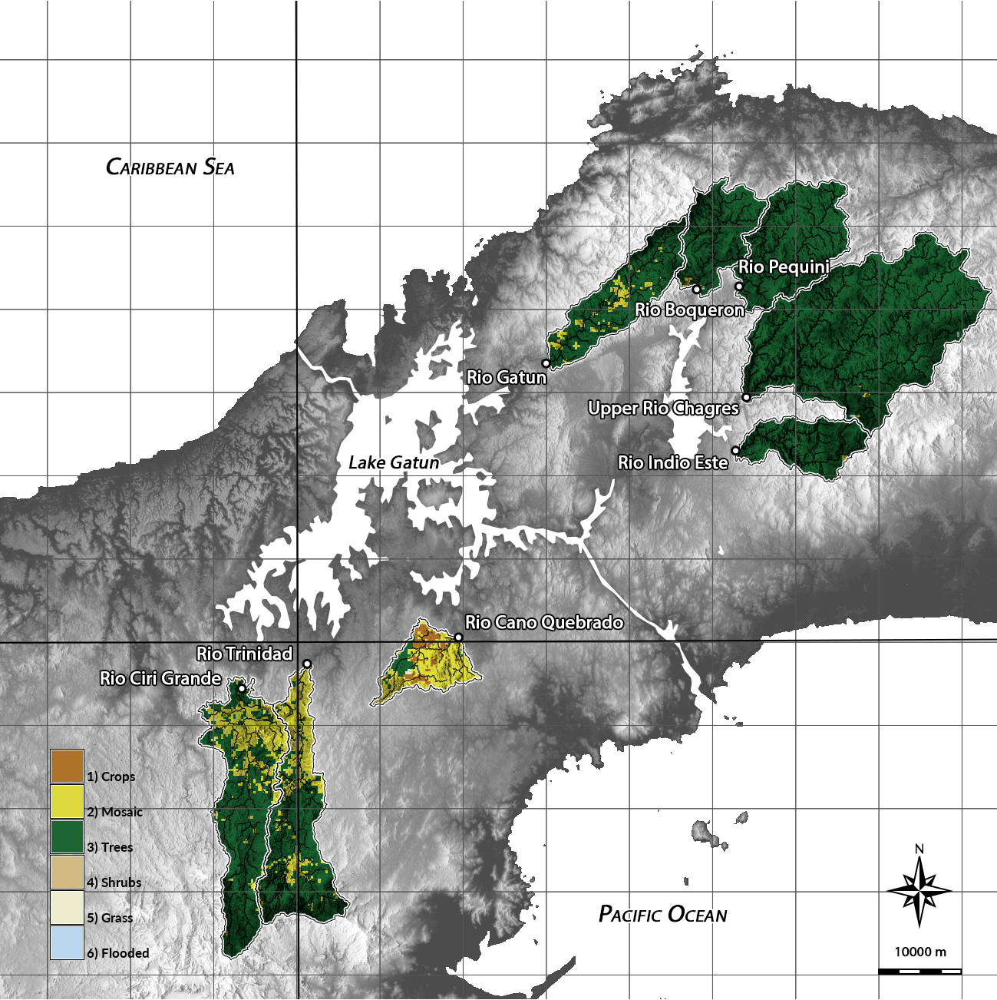

# Hydrological modeling and morphometric analysis of the Greater Panama Canal Watershed in GRASS GIS
A python script for hydrological modeling and morphometric analysis in
[GRASS GIS](grass.osgeo.org).

## License
GNU General Public License >= version 2

## Data and results
The data and results for this project are hosted
in the repository https://osf.io/bx5y6/
on the Open Science Framework
under the CC0 1.0 Universal license.

## Dependencies
Before running the script install the following GRASS GIS add-on modules with
[g.extension](https://grass.osgeo.org/grass74/manuals/g.extension.html):
* [r.skyview](https://grass.osgeo.org/grass72/manuals/addons/r.skyview.html)
* [r.hydrodem](https://grass.osgeo.org/grass72/manuals/addons/r.hydrodem.html)
* [r.stream.snap](https://grass.osgeo.org/grass72/manuals/addons/r.stream.snap.html)
* [r.stream.basins](https://grass.osgeo.org/grass72/manuals/addons/r.stream.basins.html)
* [r.stream.distance](https://grass.osgeo.org/grass72/manuals/addons/r.stream.distance.html)
* [r.stream.order](https://grass.osgeo.org/grass72/manuals/addons/r.stream.order.html)
* [r.stream.stats](https://grass.osgeo.org/grass72/manuals/addons/r.stream.stats.html)
